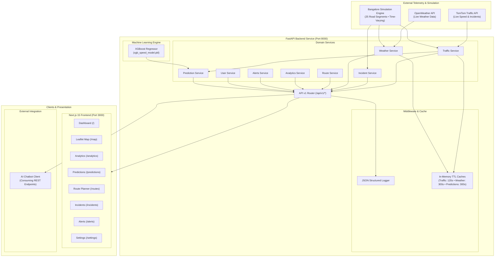

# TrafficSense.AI

[](https://opensource.org/licenses/MIT)
[](https://www.python.org/)
[](https://fastapi.tiangolo.com/)
[](https://nextjs.org/)
[](https://react.dev/)
[](https://xgboost.readthedocs.io/)
[](https://leafletjs.com/)
[](https://www.docker.com/)

**TrafficSense.AI** is an end-to-end intelligent traffic monitoring, prediction, route analysis, and situational intelligence platform specifically calibrated for **Bangalore, India**. It integrates geospatial traffic telemetry, localized weather conditions, machine learning speed forecasts, and an interactive modern web dashboard to deliver actionable urban mobility insights.

---

## Table of Contents

- [Problem](#problem)
- [Solution](#solution)
- [Key Features](#key-features)
- [Architecture](#architecture)
- [System Workflow](#system-workflow)
- [AI / ML Pipeline](#ai--ml-pipeline)
- [Tech Stack](#tech-stack)
- [Results & Empirical Evaluation](#results--empirical-evaluation)
- [Quickstart](#quickstart)
- [Project Structure](#project-structure)
- [Data](#data)
- [Model Training](#model-training)
- [Inference](#inference)
- [API Documentation](#api-documentation)
- [Dashboard & Frontend](#dashboard--frontend)
- [AI Chatbot Integration Boundary](#ai-chatbot-integration-boundary)
- [Configuration](#configuration)
- [Testing](#testing)
- [Deployment](#deployment)
- [Performance](#performance)
- [Monitoring & Logging](#monitoring--logging)
- [Security](#security)
- [Known Limitations](#known-limitations)
- [Roadmap](#roadmap)
- [Contributing](#contributing)
- [License](#license)
- [Contact](#contact)

---

## Problem

Bangalore suffers from some of the highest traffic congestion indexes globally. Commuters face volatile peak-hour delays across bottlenecks such as Silk Board, KR Puram, Outer Ring Road, and Whitefield. Urban transit management faces critical challenges:

1. **Fragmented Intelligence**: Congestion data, weather conditions, active road hazards, and routing options are rarely synthesized in real time into a unified, lightweight system.
2. **Lagging Indicators**: Traditional navigation platforms show where traffic is congested *now*, but lack short-term multi-horizon predictive forecasting (15, 30, and 60 minutes out) to help users avert bottlenecks before departure.
3. **High Credential/Cost Barriers**: Many traffic tools fail completely when external cloud API quotas expire or credentials are missing. A production-ready academic platform must provide reliable deterministic fallback simulation without breaking client-side integrations.

---

## Solution

TrafficSense.AI addresses these problems through a modular, decoupled software architecture:

- **Unified Ingestion & Hybrid Operation**: Connects to the TomTom Traffic API and OpenWeather API for live data, while offering an autonomous, time-varying Bangalore simulation engine (DEMO mode) with zero credentials required.
- **Machine Learning Forecasts**: Employs an XGBoost regressor trained on spatio-temporal lag features and weather variables to forecast segment speeds and congestion levels up to 60 minutes in advance.
- **Congestion-Aware Path Analysis**: Calculates alternative routes between key Bangalore commercial and residential hubs (e.g., Koramangala to Electronic City, Indiranagar to Airport), factoring in real-time corridor delay penalties.
- **Visual Situational Center**: Features a Next.js 15 dashboard powered by Leaflet.js interactive mapping, Recharts visual analytics, incident feeds, and customizable alert monitors.
- **Headless API for Multi-Client Consumption**: Serves as a single source of truth for both web dashboards and external conversational AI agents (chatbots).

---

## Key Features

- **25 Monitored Bangalore Corridors**: Tracks real-time velocity, free-flow velocity, and delay seconds across major hubs (Outer Ring Road, Silk Board, Whitefield, Hebbal, Indiranagar, MG Road, Electronic City, etc.).
- **Algorithmic Congestion Ratio**: Classifies road strain using a normalized clamping formula:
  $$\text{congestion\_ratio} = \text{clamp}\left(1 - \frac{v_{\text{current}}}{v_{\text{free\_flow}}},\, 0,\, 1\right)$$
  Categorized into configurable tiers: `LOW` (< 0.25), `MODERATE` (0.25–0.49), `HIGH` (0.50–0.74), and `SEVERE` (≥ 0.75).
- **Multi-Horizon XGBoost Predictions**: Predicts speed and congestion for 15, 30, and 60-minute windows with dynamic confidence score degradation.
- **Weather Correlation**: Tracks temperature, precipitation, humidity, wind velocity, and visibility, evaluating adverse weather impacts on road throughput.
- **Incident Management**: Identifies and filters active accidents, road closures, construction zones, and obstructions by severity (`LOW`, `MODERATE`, `HIGH`, `CRITICAL`).
- **Interactive Geospatial Map**: Leaflet.js map with color-coded circular road markers, custom incident pins, interactive tooltips, and an inspection side panel.
- **Analytics Visualization**: Five Recharts widgets covering congestion distributions, 24-hour speed/congestion patterns, top bottlenecked corridors, and free-flow speed comparisons.
- **Contextual Alert Engine**: Generates real-time notifications for sudden congestion spikes, severe incidents, and weather hazards with read/unread tracking.
- **User Preference Management**: In-memory state tracking for favorite Bangalore corridors, saved location coordinates, and recent trip searches.

---

## Architecture



---

## System Workflow

| Stage | Input | Processing | Output | Core Technology |
|---|---|---|---|---|
| **1. Data Ingestion** | GPS telemetry / API keys / Time ticks | Fetches TomTom/OpenWeather or evaluates time-of-day diurnal curve for Bangalore corridors | Normalized speed, free-flow metrics, active incidents, weather object | `httpx`, Python `datetime`, `cachetools` |
| **2. Congestion Modeling** | Current speed ($v$) & Free-flow speed ($v_{\text{ff}}$) | Evaluates clamp ratio: $\max(0, \min(1, 1 - v / v_{\text{ff}}))$ and maps into severity tier | Congestion ratio ($0.0 - 1.0$) and level label (`LOW`, `MODERATE`, `HIGH`, `SEVERE`) | Pydantic v2 schemas |
| **3. ML Speed Prediction** | Segment ID, free-flow speed, lag features, hour, day of week, weather | Vectorizes features into pandas DataFrame; performs XGBoost inference with confidence decay | Predicted speed (km/h), forecast congestion ratio, confidence score | `xgboost`, `scikit-learn`, `joblib` |
| **4. Route Evaluation** | Origin and destination coordinates | Calculates Haversine distances; interpolates waypoints; applies congestion penalties | Ranked primary & alternative routes with travel times and delays | Custom Haversine routing service |
| **5. API Delivery** | HTTP requests from clients | Validates queries; checks TTL memory cache; wraps in standard `AppResponse` envelope | Standardized JSON payload with metadata and `data_mode` (`live`/`demo`) | FastAPI, Starlette middleware |
| **6. Visualization** | React Query polling hooks | Hydrates responsive client components; renders interactive map markers and Recharts graphs | User-facing dashboard, route planner, and alert feeds | Next.js 15, Leaflet.js, Recharts, Tailwind CSS |

---

## AI / ML Pipeline

### Model Architecture
The traffic forecasting module uses an **XGBoost Regressor** (`xgboost.XGBRegressor`) specifically chosen for tabular spatio-temporal data due to its gradient boosting efficiency, handling of non-linear time-of-day traffic spikes, and low inference latency.

### Feature Specification
The model processes 9 input features per segment prediction:

| Feature Name | Type | Description |
|---|---|---|
| `hour` | Integer (0–23) | Hour of day (IST time frame) |
| `day_of_week` | Integer (0–6) | Day of the week (Monday = 0) |
| `is_weekend` | Binary (0 or 1) | Weekend flag (Saturday/Sunday = 1) |
| `segment_idx` | Integer (0–24) | Unique index of the monitored road segment |
| `free_flow_speed` | Float (km/h) | Nominal uncongested speed limit for the road |
| `lag_speed_1h` | Float (km/h) | Velocity observed on the segment 1 hour prior |
| `lag_congestion_1h` | Float (0.0–1.0) | Congestion ratio observed 1 hour prior |
| `temperature` | Float (°C) | Current ambient temperature |
| `is_rainy` | Binary (0 or 1) | Precipitation flag |

### Target Variable
- **`current_speed`**: Continuous velocity in km/h (constrained between 2 km/h and nominal free-flow speed).

### Multi-Horizon Forecast Handling
When predicting traffic for future time steps:
- **15 Minutes**: Baseline model inference with nominal confidence ($\sim 90\%$).
- **30 Minutes**: Temporal extrapolation; confidence decays by $-7.5\%$.
- **60 Minutes**: Temporal extrapolation; confidence decays by $-22.5\%$.

> **Note on Computer Vision:** TrafficSense.AI currently operates on spatio-temporal traffic telemetry, historical transit speeds, and weather signals. **Computer vision, video stream processing, and camera-based vehicle detection (e.g., YOLO/OpenCV) are not implemented in the current repository** and are reserved for future edge-camera integration (see [Roadmap](#roadmap)).

---

## Tech Stack

| Layer | Technology | Version / Specification | Purpose |
|---|---|---|---|
| **Frontend Framework** | Next.js | `16.3.5` (App Router, Turbopack) | Server-side rendering and static page delivery |
| **UI Library** | React | `19.0.0` | Client component architecture |
| **Styling** | Tailwind CSS | `3.4.1` | Utility-first responsive design |
| **Component Primitives** | shadcn/ui | Radix UI primitives | Accessible dialogs, selects, tabs, cards, badges |
| **Geospatial Mapping** | Leaflet.js | `react-leaflet 5.0.0` / `leaflet 1.9.4` | Interactive Bangalore map with custom HTML divIcons |
| **Data Visualization** | Recharts | `2.15.1` | Responsive charts (Pie, Line, Bar, Speed Comparison) |
| **Client State / Fetching** | TanStack Query | `@tanstack/react-query 5.66.0` | Client cache management and auto-refetching |
| **Icons** | Lucide React | `0.475.0` | Consistent UI icon system |
| **Backend Framework** | FastAPI | `>=0.100.0` | High-performance asynchronous REST API |
| **ASGI Server** | Uvicorn | `[standard] >=0.22.0` | ASGI application server |
| **Data Validation** | Pydantic v2 | `>=2.0.0` / `pydantic-settings` | Schema validation and settings parsing |
| **Machine Learning** | XGBoost | `>=1.7.0` | Gradient boosted tree speed prediction |
| **Data Science / Stats** | scikit-learn / pandas / numpy | Latest stable | Data preprocessing and model evaluation metrics |
| **Model Serialization** | Joblib | `>=1.3.0` | Binary artifact persistence (`.pkl`) |
| **Caching Layer** | Cachetools | `>=5.3.0` | Thread-safe in-memory TTL caching |
| **Containerization** | Docker / Compose | Multi-stage builds | Production and local container deployment |
| **Testing** | Pytest / TestClient | `>=7.4.0` | Comprehensive integration testing suite |

---

## Results & Empirical Evaluation

The XGBoost model was evaluated using a strict **time-aware chronological split** across 90 days of synthetic Bangalore traffic data (54,000 records) to eliminate data leakage across consecutive hours:
- **Training Set**: Days 0–62 (37,800 samples)
- **Validation Set**: Days 63–76 (8,400 samples)
- **Test Set**: Days 77–89 (7,800 samples)

### Test Set Performance Metrics

| Metric | Result | Interpretation |
|---|---|---|
| **Mean Absolute Error (MAE)** | **4.578 km/h** | Average deviation between actual and predicted speed |
| **Root Mean Squared Error (RMSE)** | **5.986 km/h** | Low penalization on extreme speed outliers |
| **Coefficient of Determination ($R^2$)** | **0.8911** | Model accounts for ~89.1% of speed variance |

### Feature Importance Breakdown

```
        lag_speed_1h: ▇▇▇▇▇▇▇▇▇▇▇▇▇▇▇▇▇▇▇▇▇▇▇▇▇▇▇▇▇▇ 0.6154
     free_flow_speed: ▇▇▇▇▇ 0.0977
   lag_congestion_1h: ▇▇▇▇ 0.0920
          is_weekend: ▇▇▇ 0.0728
                hour: ▇▇ 0.0579
         day_of_week: █ 0.0242
            is_rainy: █ 0.0169
         segment_idx: █ 0.0166
         temperature:  0.0065
```

> **Benchmark Notice:** Metrics for camera-based vehicle detection (mAP, FPS, vehicle counting accuracy) are not benchmarked because video processing models are not implemented in this repository.

---

## Quickstart

### 1. Clone the Repository

```bash
git clone https://github.com/Shashwat-19/TrafficSense-AI.git
cd TrafficSense-AI
```

### 2. Run with Docker Compose (Recommended)

To run the entire system in containerized mode with one command:

```bash
# Copy default environment file
cp backend/.env.example backend/.env

# Build and start services
docker-compose up --build
```
- Frontend application: **http://localhost:3000**
- Backend Swagger docs: **http://localhost:8000/docs**

---

### 3. Run Locally (Development Mode)

#### A. Backend Setup
```bash
cd backend

# Create and activate virtual environment
python3 -m venv venv
source venv/bin/activate       # macOS/Linux
# .\venv\Scripts\activate      # Windows

# Install dependencies
pip install -r requirements.txt

# Create environment file
cp .env.example .env

# (Optional) Retrain ML model
python train_model.py

# Launch FastAPI
uvicorn app.main:app --host 0.0.0.0 --port 8000 --reload
```

Verify backend health:
```bash
curl http://localhost:8000/api/v1/health
```

#### B. Frontend Setup (in a new terminal)
```bash
cd frontend

# Install Node modules
npm install

# Create environment file
cp .env.local.example .env.local

# Run Next.js in development mode
npm run dev
```

Open your browser at **http://localhost:3000**.

---

## Project Structure

```text
.
├── backend/
│   ├── app/
│   │   ├── api/
│   │   │   └── v1/
│   │   │       └── endpoints.py         # All REST route declarations
│   │   ├── core/
│   │   │   ├── config.py                # Pydantic BaseSettings & thresholds
│   │   │   └── middleware.py            # Structured JSON latency logging
│   │   ├── models/
│   │   │   ├── artifacts/
│   │   │   │   └── xgb_speed_model.pkl  # Serialized trained XGBoost model
│   │   │   └── schemas.py               # Pydantic data schemas & enums
│   │   ├── services/
│   │   │   ├── alerts.py                # Congestion and hazard alerts service
│   │   │   ├── analytics.py             # Hourly trends and aggregate analytics
│   │   │   ├── incident.py              # Road incidents and hazard tracking
│   │   │   ├── prediction.py            # ML speed forecast engine
│   │   │   ├── route.py                 # Alternative pathfinder & delay analysis
│   │   │   ├── traffic.py               # 25 Bangalore road segments & simulation
│   │   │   ├── user.py                  # User preferences and saved locations
│   │   │   └── weather.py               # Weather patterns & OpenWeather client
│   │   └── main.py                      # FastAPI app entry point & CORS
│   ├── tests/
│   │   └── test_api.py                  # Pytest test suite (15 tests)
│   ├── Dockerfile                       # Python 3.11 slim container
│   ├── requirements.txt                 # Backend Python dependencies
│   └── train_model.py                   # XGBoost model training pipeline
├── frontend/
│   ├── public/                          # Static assets and marker notes
│   ├── src/
│   │   ├── app/
│   │   │   ├── alerts/page.tsx          # Real-time alerts feed
│   │   │   ├── analytics/page.tsx       # Recharts traffic analytics dashboard
│   │   │   ├── incidents/page.tsx       # Filterable incident directory
│   │   │   ├── map/page.tsx             # Interactive Leaflet traffic map
│   │   │   ├── predictions/page.tsx     # ML forecast horizon interface
│   │   │   ├── routes/page.tsx          # Bangalore landmark route planner
│   │   │   ├── settings/page.tsx        # User settings & API connectivity
│   │   │   ├── layout.tsx               # Root layout with sidebar and header
│   │   │   ├── page.tsx                 # Primary KPI overview dashboard
│   │   │   └── providers.tsx            # TanStack React Query provider
│   │   ├── components/
│   │   │   ├── layout/                  # Sidebar, Header navigation shell
│   │   │   ├── traffic/                 # MetricCard, CongestionBadge, LeafletMap
│   │   │   └── ui/                      # 13 shadcn UI Radix components
│   │   ├── lib/
│   │   │   ├── api/client.ts            # Typed HTTP API client
│   │   │   ├── congestion.ts            # Color palettes and formatting helpers
│   │   │   └── utils.ts                 # Tailwind class merger (cn)
│   │   └── types/
│   │       └── index.ts                 # TypeScript domain interfaces
│   ├── Dockerfile                       # Multi-stage production Next.js build
│   └── package.json                     # Frontend dependencies and scripts
├── .gitignore                           # Repository ignore rules
├── docker-compose.yml                   # Multi-container orchestration
├── LICENSE                              # MIT License file
├── README.md                            # Comprehensive project documentation
└── run.md                               # Operational runbook
```

---

## Data

TrafficSense.AI monitors **25 major road corridors across Bangalore**:

```text
Silk Board Junction, Koramangala 80ft Road, Electronic City Flyover,
Outer Ring Road (Bellandur), Marathahalli Bridge, Whitefield Main Road,
Indiranagar 100ft Road, Old Airport Road, MG Road, Residency Road,
Hosur Road, Bannerghatta Road, JP Nagar 24th Main, Jayanagar 4th Block,
Hebbal Flyover, Bellary Road, Tumkur Road, Yeshwantpur Circle,
Majestic / City Railway Station, KR Puram Bridge, Tin Factory Junction,
Old Madras Road, Sarjapur Road, Richmond Road, Brigade Road
```

### Data Modes
1. **DEMO Mode (Zero-Config Default)**: When no API keys are supplied, the platform executes a deterministic time-varying simulation modeled on actual Bangalore commuting patterns:
   - Morning peak rush hours: 08:00 – 10:00 IST ($80\%\text{--}95\%$ capacity)
   - Evening peak rush hours: 17:00 – 20:00 IST ($75\%\text{--}95\%$ capacity)
   - Midday lull: 12:00 – 14:00 IST
   - Night free-flow: 22:00 – 05:00 IST
2. **LIVE Mode**: Set `TOMTOM_API_KEY` and `OPENWEATHER_API_KEY` to ingest live streaming traffic speeds and weather reports.

---

## Model Training

To retrain the XGBoost predictive model:

```bash
cd backend
source venv/bin/activate
python train_model.py
```

### Hyperparameter Configuration

```python
model = xgb.XGBRegressor(
    objective="reg:squarederror",
    n_estimators=200,
    max_depth=6,
    learning_rate=0.1,
    subsample=0.8,
    colsample_bytree=0.8,
    random_state=42
)
```

The script outputs training metrics, logs feature importances, and automatically writes the serialized model to `app/models/artifacts/xgb_speed_model.pkl`.

---

## Inference

Model inference is executed via the `PredictionService` in `backend/app/services/prediction.py`:

1. Features are dynamically constructed from the current segment velocity, historical lag estimates, calendar day, hour (IST), and live weather.
2. The loaded XGBoost model produces an inferred vehicle speed (km/h).
3. The predicted speed is converted into a predicted congestion ratio and severity level.
4. Confidence ratings are adjusted based on prediction horizon.

To trigger inference directly via curl:

```bash
# 15-minute horizon prediction for all segments
curl "http://localhost:8000/api/v1/predictions?horizon=15"

# 30-minute prediction for a specific road (e.g. Silk Board: seg-001)
curl "http://localhost:8000/api/v1/predictions?horizon=30&segment_id=seg-001"
```

> **Camera/RTSP Inference Note**: Direct video file ingestion, webcam capture, and RTSP stream inference are not supported by the current codebase.

---

## API Documentation

All responses are wrapped in a standard `AppResponse` envelope:
```json
{
  "data": { ... },
  "data_mode": "demo",
  "last_updated": "2026-09-22T12:00:00Z",
  "source": "traffic"
}
```

### Endpoints Specification

| Method | Endpoint | Description | Query Parameters |
|---|---|---|---|
| `GET` | `/api/v1/health` | Service health status and timestamp | None |
| `GET` | `/api/v1/traffic/current` | Telemetry for all 25 Bangalore segments | None |
| `GET` | `/api/v1/traffic/incidents` | Active road incidents and hazards | `severity`, `incident_type` |
| `GET` | `/api/v1/weather` | Current Bangalore weather metrics | None |
| `GET` | `/api/v1/predictions` | ML speed and congestion predictions | `horizon` (15, 30, 60), `segment_id` |
| `POST` | `/api/v1/routes` | Multi-alternative route recommendation | Body: `RouteRequest` (JSON) |
| `GET` | `/api/v1/analytics` | Aggregated city statistics & trends | None |
| `GET` | `/api/v1/alerts` | Active traffic and hazard alert items | `alert_type`, `severity` |
| `GET` | `/api/v1/users/preferences` | Fetch user locations and settings | None |
| `PUT` | `/api/v1/users/preferences` | Update user notification and units state | Body: `UserPreferences` (JSON) |

### Interactive API Explorers
When the backend is active, explore and test the API directly:
- **Swagger UI**: [http://localhost:8000/docs](http://localhost:8000/docs)
- **ReDoc**: [http://localhost:8000/redoc](http://localhost:8000/redoc)

---

## Dashboard & Frontend

The frontend is implemented with the Next.js 15 App Router and organized into 8 functional views:

| View | Path | Implementation Details |
|---|---|---|
| **Overview Dashboard** | `/` | Congestion KPI badges, average city speed, weather card, top 5 bottleneck corridors, and recent alert feed. |
| **Interactive Map** | `/map` | Full-height Leaflet.js map with circle markers (colored by congestion level), custom HTML incident pins, and click-to-inspect side panel. |
| **Analytics** | `/analytics` | Five Recharts charts: Congestion level breakdown (Pie), 24h speed/congestion trends (Line), top congested corridors (Bar), and speed vs. free-flow limits. |
| **ML Predictions** | `/predictions` | Tabbed selector for 15/30/60-minute prediction horizons, road dropdown filter, card grid, and comparison bar chart. |
| **Route Planner** | `/routes` | Trip planner with Bangalore landmark presets (Koramangala, Indiranagar, Electronic City, Whitefield, Airport, etc.) and congestion-avoiding route comparisons. |
| **Incidents** | `/incidents` | Filterable incident feed with category and severity dropdowns (Accidents, Road Closures, Construction). |
| **Alerts Feed** | `/alerts` | Chronological notifications with read/unread toggles and urgency color-coding. |
| **Settings** | `/settings` | Live/Demo mode badge, API connectivity status, saved locations, recent trip queries, and display units. |

---

## AI Chatbot Integration Boundary

TrafficSense.AI is designed to decouple traffic intelligence from conversational interfaces. A separate AI chatbot client can connect to the platform as an external consumer:

```
[User] <--> [AI Chatbot Agent] <--(HTTP GET/POST)--> [TrafficSense.AI REST API (/api/v1/*)]
```

### Integration Contract
- **Protocol**: Standard REST over HTTP (`application/json`).
- **Data Exposed**: Current road speeds (`/api/v1/traffic/current`), active hazards (`/api/v1/traffic/incidents`), ML forecasts (`/api/v1/predictions`), weather conditions (`/api/v1/weather`), and route alternatives (`/api/v1/routes`).
- **Query Types Supported by API**:
  - *"What is the traffic like on Outer Ring Road right now?"* $\rightarrow$ Query `/api/v1/traffic/current`
  - *"How bad will Silk Board congestion be in 30 minutes?"* $\rightarrow$ Query `/api/v1/predictions?horizon=30&segment_id=seg-001`
  - *"Are there any accidents near Whitefield?"* $\rightarrow$ Query `/api/v1/traffic/incidents?severity=HIGH`
  - *"What is the fastest route from Koramangala to the Airport?"* $\rightarrow$ Query `POST /api/v1/routes`
- **Isolation**: The chatbot client codebase is decoupled from this repository. No internal chatbot code is modified here, ensuring strict separation of concerns.

---

## Configuration

All configuration is managed through environment variables:

### Backend (`backend/.env`)

| Variable | Type | Default | Description |
|---|---|---|---|
| `TOMTOM_API_KEY` | String | `""` | TomTom Traffic API key for live flow data |
| `OPENWEATHER_API_KEY` | String | `""` | OpenWeather API key for live weather conditions |
| `APP_ENV` | String | `"development"` | Application environment (`development` or `production`) |
| `CORS_ORIGINS` | List[String] | `["http://localhost:3000","http://localhost:8000"]` | Allowed CORS origins (comma-separated) |
| `CONGESTION_LOW` | Float | `0.25` | Threshold below which traffic is marked LOW |
| `CONGESTION_MODERATE` | Float | `0.50` | Threshold below which traffic is marked MODERATE |
| `CONGESTION_HIGH` | Float | `0.75` | Threshold below which traffic is marked HIGH |
| `TRAFFIC_CACHE_TTL` | Integer | `120` | In-memory cache duration for traffic data in seconds |
| `WEATHER_CACHE_TTL` | Integer | `300` | In-memory cache duration for weather data in seconds |
| `PREDICTION_CACHE_TTL` | Integer | `300` | In-memory cache duration for predictions in seconds |
| `ANALYTICS_CACHE_TTL` | Integer | `180` | In-memory cache duration for analytics in seconds |

### Frontend (`frontend/.env.local`)

| Variable | Type | Default | Description |
|---|---|---|---|
| `NEXT_PUBLIC_API_URL` | String | `"http://localhost:8000"` | Base URL of the FastAPI backend service |

---

## Testing

### Backend Test Suite (Pytest)
The test suite covers all API endpoints, query validations, schema compliance, and status codes:

```bash
cd backend
source venv/bin/activate
pytest tests/ -v
```

**Results**: `15 passed in ~1.4s` (100% test pass rate across health, traffic, incidents, weather, prediction horizons, routes, analytics, alerts, and user preferences).

### Frontend Build & Type-Check
The frontend uses Turbopack and strict TypeScript validation:

```bash
cd frontend
npm run build
```

**Results**: Compiled successfully with zero TypeScript and zero ESLint errors across all 8 static pages.

---

## Deployment

### Docker Multi-Container Architecture
The repository includes production-ready Docker configurations for both tiers:

- **Backend Container (`backend/Dockerfile`)**: `python:3.11-slim`, installs production wheels, exposes port 8000, runs Uvicorn.
- **Frontend Container (`frontend/Dockerfile`)**: Multi-stage `node:18-alpine` builder and runner, bundles `.next` standalone output, exposes port 3000.
- **Orchestration (`docker-compose.yml`)**: Links the frontend and backend onto an internal bridge network with healthchecks.

To deploy on any Docker-compatible server or cloud VM:
```bash
docker-compose up -d
```

### Cloud Production Readiness
- **Backend**: Ready for container deployment on AWS ECS, AWS App Runner, Google Cloud Run, or DigitalOcean App Platform.
- **Frontend**: Ready for deployment on Vercel, AWS Amplify, or containerized ECS.

---

## Performance

- **API Latency**: In-memory cache hits respond in **< 10ms**. External API calls are guarded by a 10-second timeout and 3-retry backoff.
- **Cache Strategy**: Dynamic TTL caches (`cachetools.TTLCache`) eliminate redundant network calls:
  - Traffic: 120s TTL
  - Weather: 300s TTL
  - Predictions: 300s TTL
  - Analytics: 180s TTL
- **Frontend Bundle**: Fully static prerendering across all 8 routes (`○ Static`) for immediate First Contentful Paint (FCP).

---

## Monitoring & Logging

TrafficSense.AI incorporates a structured JSON logging middleware (`backend/app/core/middleware.py`) that formats every request for automated log aggregators (e.g., Datadog, AWS CloudWatch, Grafana Loki):

```json
{
  "request_id": "8f3b2d10-449e-4a6c-9c74-2cf1f73bca41",
  "method": "GET",
  "path": "/api/v1/traffic/current",
  "status_code": 200,
  "latency_ms": 3.42,
  "timestamp": "2026-09-22T12:00:00.000000Z"
}
```

---

## Security

- **Input Validation**: Pydantic v2 enforces strict type checks on all request payloads (e.g. valid latitude/longitude coordinates and strict integer horizons).
- **CORS Protection**: Access is restricted to configured origins (`settings.CORS_ORIGINS`).
- **Credential Safety**: No hardcoded API keys; all sensitive tokens are loaded from `.env` files which are ignored in `.gitignore`.
- **Error Sanitization**: Unhandled exceptions return generic 500 errors to prevent stack trace leakage to external clients.

---

## Known Limitations

1. **Computer Vision Absence**: There is currently no active video/camera ingestion pipeline (no YOLO or RTSP streaming models).
2. **Third-Party API Requirements**: Live mode requires active API keys for TomTom and OpenWeather; without keys, the system operates in simulated DEMO mode.
3. **In-Memory Storage**: User preferences and bookmarks are stored in-memory during development; a persistent database (PostgreSQL/DynamoDB) is required for production multi-tenant persistence.
4. **Interpolated Routing**: Route paths use straight-line waypoint interpolation between Bangalore coordinates rather than full turn-by-turn vector geometries.

---

## Roadmap

### Completed
- [x] High-performance FastAPI backend with structured logging and OpenAPI docs
- [x] 25 Bangalore road segments with time-varying diurnal simulation
- [x] XGBoost traffic speed regressor with time-aware evaluation ($R^2 = 0.891$)
- [x] Dynamic multi-horizon predictions (15, 30, and 60 minutes)
- [x] Route alternatives engine with congestion-aware penalties
- [x] Next.js 15 frontend with responsive navigation and dark/light system styling
- [x] Interactive Leaflet.js Bangalore traffic map
- [x] Recharts traffic analytics and incident visualization
- [x] Docker and Docker Compose deployment orchestration
- [x] 15/15 unit and integration API test coverage

### In Progress
- [ ] Database integration (PostgreSQL with SQLAlchemy / Alembic migrations)
- [ ] User authentication and session management (JWT / OAuth2)

### Planned
- [ ] Edge computer vision ingestion pipeline (YOLOv8 + ByteTRACK for live CCTV vehicle counting)
- [ ] OpenStreetMap turn-by-turn routing geometry integration
- [ ] Webhook-driven push notification channels (SMS / WhatsApp alerts for critical traffic incidents)

---

## Contributing

1. Fork the repository.
2. Create a feature branch: `git checkout -b feature/amazing-feature`.
3. Commit your changes: `git commit -m "feat: add amazing feature"`.
4. Push to the branch: `git push origin feature/amazing-feature`.
5. Open a Pull Request.

Please ensure all backend tests pass (`pytest tests/`) and the frontend builds cleanly (`npm run build`) before submitting.

---

## License

This project is licensed under the **MIT License**. See the [LICENSE](LICENSE) file for complete details.

---

## Contact

- **Author**: Shashwat
- **Email**: [shashwat1956@gmail.com](mailto:shashwat1956@gmail.com)
- **Project Link**: [https://github.com/Shashwat-19/TrafficSense-AI](https://github.com/Shashwat-19/TrafficSense-AI)