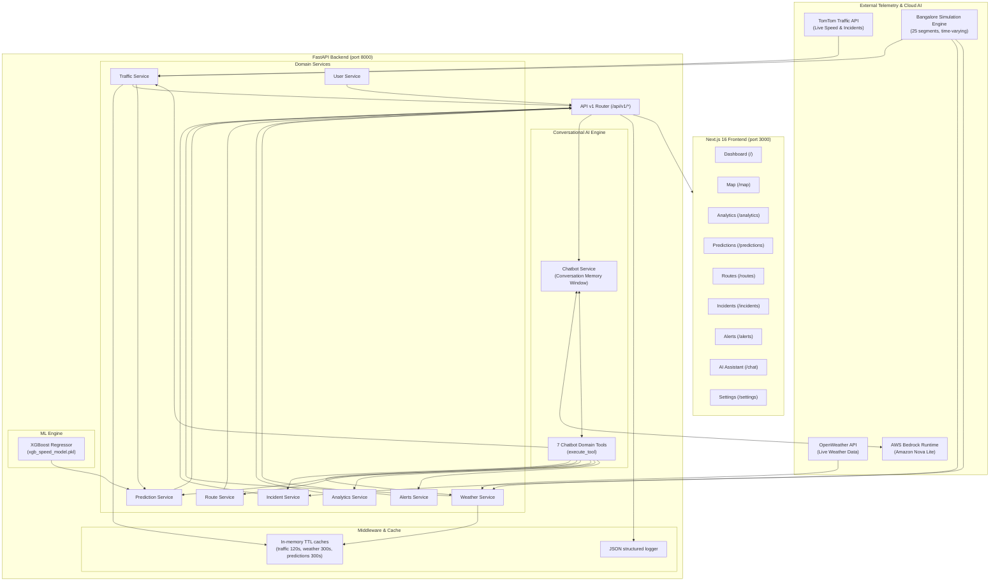

# TrafficSense.AI

<p>
  <a href="https://opensource.org/licenses/MIT"></a>
  <a href="https://www.python.org/"></a>
  <a href="https://fastapi.tiangolo.com/"></a>
  <a href="https://nextjs.org/"></a>
  <a href="https://react.dev/"></a>
  <a href="https://aws.amazon.com/bedrock/"></a>
  <a href="https://xgboost.readthedocs.io/"></a>
  <a href="https://leafletjs.com/"></a>
  <a href="https://www.docker.com/"></a>
  <a href=""></a>
</p>

**TrafficSense.AI** is an end-to-end intelligent traffic monitoring, prediction, route-analysis, and situational-intelligence platform calibrated for **Bangalore, India**. It combines geospatial traffic telemetry, localized weather conditions, machine learning speed forecasts, an interactive web dashboard, and a **native conversational AI assistant powered by AWS Bedrock** that queries live domain services via dynamic tool calling.

---

## Table of Contents

- [Problem](#problem)
- [Solution](#solution)
- [Key Features](#key-features)
- [Architecture](#architecture)
- [System Workflow](#system-workflow)
- [AI Assistant & Bedrock Integration](#ai-assistant--bedrock-integration)
- [AI / ML Pipeline](#ai--ml-pipeline)
- [Tech Stack](#tech-stack)
- [Results & Evaluation](#results--evaluation)
- [Quickstart](#quickstart)
- [Project Structure](#project-structure)
- [Data](#data)
- [Model Training](#model-training)
- [Inference](#inference)
- [API Reference](#api-reference)
- [Dashboard & Frontend](#dashboard--frontend)
- [Configuration](#configuration)
- [Testing](#testing)
- [Deployment](#deployment)
- [Performance](#performance)
- [Monitoring & Logging](#monitoring--logging)
- [Security](#security)
- [Known Limitations](#known-limitations)
- [Roadmap](#roadmap)
- [Contributing](#contributing)
- [License](#license)
- [Contact](#contact)

---

## Problem

Bangalore has one of the highest congestion indexes globally, with volatile peak-hour delays at bottlenecks like Silk Board, KR Puram, Outer Ring Road, and Whitefield. Existing tooling falls short in three ways:

1. **Fragmented intelligence** — congestion, weather, hazards, and routing are rarely synthesized into a single lightweight system.
2. **Lagging indicators** — most navigation tools show current congestion, not short-horizon forecasts (15/30/60 min) that let a user avoid a bottleneck before departing.
3. **Hard dependency on paid APIs** — many traffic tools break entirely once a third-party quota or credential expires, with no deterministic fallback.

## Solution

- **Hybrid ingestion** — live telemetry from the TomTom Traffic API and OpenWeather API, or a zero-credential, time-varying Bangalore simulation engine (`DEMO` mode) when keys aren't configured.
- **ML forecasting** — an XGBoost regressor trained on spatio-temporal lag features and weather variables predicts segment speed and congestion up to 60 minutes ahead.
- **Congestion-aware routing** — alternative routes between major Bangalore hubs (e.g., Koramangala → Electronic City), scored with real-time delay penalties.
- **Conversational AI Assistant** — fully integrated AWS Bedrock LLM agent (Amazon Nova Lite) equipped with 7 backend tools to query live telemetry, predictions, weather, and routes dynamically.
- **Situational dashboard** — a Next.js 16 app with a Leaflet map, Recharts analytics, an incident feed, route planning, and alerting.
- **Unified REST API** — one headless source of truth consumed by both the web dashboard and AI assistant.

## Key Features

- **25 monitored Bangalore corridors** — real-time speed, free-flow speed, and delay across Outer Ring Road, Silk Board, Whitefield, Hebbal, Indiranagar, MG Road, Electronic City, and more.
- **Congestion ratio** — normalized, clamped score used to classify road strain:

  $$\text{congestion\_ratio} = \text{clamp}\left(1 - \frac{v_{\text{current}}}{v_{\text{free\_flow}}},\, 0,\, 1\right)$$

  Tiers: `LOW` (< 0.25), `MODERATE` (0.25–0.49), `HIGH` (0.50–0.74), `SEVERE` (≥ 0.75).
- **Native Conversational AI Assistant** — Ask natural-language questions about current traffic, forecasts, routes, weather, and incidents; powered by AWS Bedrock with tool calling and context memory.
- **Multi-horizon predictions** — 15/30/60-minute speed and congestion forecasts with horizon-dependent confidence decay.
- **Weather correlation** — temperature, precipitation, humidity, wind, and visibility factored into throughput impact.
- **Incident management** — accidents, closures, construction, and obstructions, filterable by severity (`LOW`/`MODERATE`/`HIGH`/`CRITICAL`).
- **Interactive map** — Leaflet.js with color-coded segment markers, incident pins, and an inspection panel.
- **Analytics** — five Recharts widgets: congestion distribution, 24h speed/congestion trends, top bottlenecks, free-flow comparisons.
- **Alerting** — real-time notifications for congestion spikes, severe incidents, and weather hazards, with read/unread state.
- **User preferences** — in-memory favorites, saved locations, and recent trip searches.

> Computer vision is **not** part of this repository. TrafficSense.AI operates purely on telemetry, historical speeds, and weather signals — no camera or video ingestion is implemented. See [Roadmap](#roadmap).

---

## Architecture



---

## System Workflow

| Stage | Input | Processing | Output | Core Tech |
|---|---|---|---|---|
| **1. Data ingestion** | API keys / time ticks | Fetch TomTom & OpenWeather, or evaluate diurnal simulation curve | Normalized speed, free-flow, incidents, weather | `httpx`, `datetime`, `cachetools` |
| **2. Congestion modeling** | Current speed, free-flow speed | Clamp ratio + severity mapping | Congestion ratio (0–1) + level label | Pydantic v2 |
| **3. ML prediction** | Segment ID, free-flow speed, lag features, hour, day, weather | Vectorize → XGBoost inference with confidence decay | Predicted speed, forecast congestion, confidence | `xgboost`, `scikit-learn`, `joblib` |
| **4. Route evaluation** | Origin/destination coordinates | Haversine distance, waypoint interpolation, congestion penalties | Ranked primary + alternative routes | Custom Haversine router |
| **5. AI Assistant** | Natural language message | Bedrock Converse API → multi-step tool execution loop → synthesis | Contextual answer + UI actions (`FOCUS_MAP`, etc.) | AWS Bedrock, `boto3`, Pydantic |
| **6. API delivery** | HTTP request | Validate → TTL cache check → `AppResponse` envelope | Standard JSON with `data_mode` (`live`/`demo`) | FastAPI, Starlette |
| **7. Visualization** | React Query polling & actions | Hydrate components, render map/charts/chat messages | Dashboard, map, route planner, chat assistant | Next.js 16, Leaflet.js, Recharts, Tailwind CSS |

---

## AI Assistant & Bedrock Integration

TrafficSense.AI features an **integrated conversational AI agent** powered by **AWS Bedrock** (Amazon Nova Lite `amazon.nova-lite-v1:0`). Unlike simple standalone text chatbots, it operates in a **tool-use loop** directly connected to backend traffic telemetry, ML models, and routing engines.

### How the Tool Calling Works

```
User Query: "What is traffic like on Outer Ring Road and will it get worse in 30 minutes?"
   │
   ▼
POST /api/v1/chat ──► ChatbotService ──► Bedrock Converse API
                                               │
                                 ┌─────────────┴─────────────┐
                                 ▼                           ▼
                        Tool 1: get_current_traffic   Tool 2: get_traffic_prediction
                        (road: "Outer Ring Road")    (horizon: 30, road: "Outer Ring Road")
                                 │                           │
                                 └─────────────┬─────────────┘
                                               ▼
                              Bedrock Synthesizes Real Data
                                               │
                                               ▼
               Response + UI Actions (e.g. FOCUS_MAP lat/lng) returned to Chat UI
```

### Available Chatbot Tools

| Tool Name | Service Invoked | Functionality |
|---|---|---|
| `get_current_traffic` | `TrafficService` | Real-time speeds, congestion ratio, delays for 25 Bangalore segments |
| `get_traffic_incidents` | `IncidentService` | Active accidents, roadworks, obstructions, closures with severity filters |
| `get_weather` | `WeatherService` | Current temperature, conditions, humidity, precipitation, wind, visibility |
| `get_traffic_prediction` | `PredictionService` | XGBoost ML speed forecasts at 15, 30, or 60-minute horizons with confidence score |
| `find_route` | `RouteService` | Bangalore landmark pathfinder with alternatives and congestion avoidance |
| `get_traffic_analytics` | `AnalyticsService` | Citywide congestion averages, top bottlenecks, 24h pattern trends |
| `get_alerts` | `AlertsService` | Active traffic warnings, weather hazards, and route delay notices |

### Context Memory Window

Conversations maintain multi-turn context (e.g., asking about *"Outer Ring Road"* first, then following up with *"What about in 30 minutes?"* retains the corridor reference). The in-memory `ConversationStore` maintains a sliding window of the last 20 messages per `conversation_id`.

### Example Chat API Request

```bash
curl -X POST http://localhost:8000/api/v1/chat \
  -H "Content-Type: application/json" \
  -d '{
    "message": "How is traffic on Outer Ring Road right now?"
  }'
```

**Response:**
```json
{
  "response": "The current traffic conditions on Outer Ring Road are as follows:\n- Near Marathahalli: speed is 45.2 km/h (free-flow: 50.0 km/h) with LOW congestion.\n- Near Bellandur: speed is 49.6 km/h with LOW congestion.",
  "conversation_id": "14d780f5-92b0-46a9-9ec6-724a2878d2e1",
  "sources": ["get_current_traffic"],
  "tools_used": ["get_current_traffic"],
  "actions": [
    {
      "type": "FOCUS_MAP",
      "latitude": 12.9537,
      "longitude": 77.7012,
      "zoom": 14
    }
  ],
  "timestamp": "2026-09-23T17:26:02.123456+00:00"
}
```

---

## AI / ML Pipeline

### Model

An **XGBoost Regressor** (`xgboost.XGBRegressor`) — chosen for tabular spatio-temporal data, efficient handling of non-linear time-of-day traffic spikes, and low inference latency.

### Features (9 per prediction)

| Feature | Type | Description |
|---|---|---|
| `hour` | int (0–23) | Hour of day, IST |
| `day_of_week` | int (0–6) | Monday = 0 |
| `is_weekend` | binary | Sat/Sun = 1 |
| `segment_idx` | int (0–24) | Monitored segment index |
| `free_flow_speed` | float (km/h) | Nominal uncongested speed |
| `lag_speed_1h` | float (km/h) | Speed observed 1h prior |
| `lag_congestion_1h` | float (0–1) | Congestion ratio 1h prior |
| `temperature` | float (°C) | Current ambient temperature |
| `is_rainy` | binary | Precipitation flag |

**Target:** `current_speed` (km/h, clamped between 2 km/h and free-flow speed).

### Multi-Horizon Confidence Decay

| Horizon | Confidence |
|---|---|
| 15 min | Baseline (~90%) |
| 30 min | −7.5% |
| 60 min | −22.5% |

---

## Tech Stack

| Layer | Technology | Version | Purpose |
|---|---|---|---|
| Frontend framework | Next.js | 16.3.5 (App Router, Turbopack) | SSR + static delivery |
| UI library | React | 19.0.0 | Client component architecture |
| Styling | Tailwind CSS | 4.x / 3.4 compatible | Utility-first styling |
| Component primitives | shadcn/ui (Radix) | Latest | Accessible dialogs, tabs, cards, badges |
| Mapping | Leaflet.js / react-leaflet | 1.9.4 / 5.0 | Interactive map with custom markers |
| Charts | Recharts | 2.15 | Pie/Line/Bar analytics |
| Client state | TanStack Query | 5.66 | Cache + auto-refetch |
| Icons | Lucide React | 0.475 | Icon system |
| Backend framework | FastAPI | ≥0.100 | Async REST API |
| ASGI server | Uvicorn | ≥0.22 | High-performance app server |
| AI / LLM Integration | AWS Bedrock Runtime (`boto3`) | ≥1.28.0 | Amazon Nova Lite with tool-use loop |
| Validation | Pydantic v2 | ≥2.0 | Schemas & settings |
| ML | XGBoost | ≥1.7 | Gradient-boosted regression |
| Data science | scikit-learn, pandas, numpy | Latest | Preprocessing & evaluation |
| Serialization | Joblib | ≥1.3 | Model artifact persistence |
| Caching | Cachetools | ≥5.3 | In-memory TTL cache |
| Containers | Docker / Compose | Multi-stage | Local & production deployment |
| Testing | Pytest / TestClient | ≥7.4 | Comprehensive integration test suite (22 tests) |

---

## Results & Evaluation

Evaluated on a strict **time-aware chronological split** over 90 days of synthetic Bangalore traffic data (54,000 records) to prevent leakage across consecutive hours:

- Train: days 0–62 (37,800 samples)
- Validation: days 63–76 (8,400 samples)
- Test: days 77–89 (7,800 samples)

### Test Set Metrics

| Metric | Result | Interpretation |
|---|---|---|
| MAE | **4.578 km/h** | Average deviation, actual vs. predicted |
| RMSE | **5.986 km/h** | Low penalty on extreme outliers |
| R² | **0.8911** | ~89.1% of speed variance explained |

### Feature Importance

```
lag_speed_1h       0.6154  ██████████████████████████████
free_flow_speed    0.0977  █████
lag_congestion_1h  0.0920  ████
is_weekend         0.0728  ███
hour               0.0579  ██
day_of_week        0.0242  █
is_rainy           0.0169  █
segment_idx        0.0166  █
temperature        0.0065  ▏
```

---

## Quickstart

### 1. Clone the Repository

```bash
git clone https://github.com/Shashwat-19/TrafficSense-AI.git
cd TrafficSense-AI
```

### 2. Run with Docker Compose (Recommended)

```bash
cp backend/.env.example backend/.env
docker-compose up --build
```

- Frontend: `http://localhost:3000`
- AI Assistant: `http://localhost:3000/chat`
- Backend Swagger docs: `http://localhost:8000/docs`

### 3. Local Development

**Backend Setup**

```bash
cd backend
python3 -m venv venv
source venv/bin/activate          # Windows: .\venv\Scripts\activate
pip install -r requirements.txt
cp .env.example .env              # Configure AWS & optional API keys
python train_model.py             # Optional: retrain model
uvicorn app.main:app --host 0.0.0.0 --port 8000 --reload
```

Verify backend health:
```bash
curl http://localhost:8000/api/v1/health
```

**Frontend Setup** (in a separate terminal)

```bash
cd frontend
npm install
cp .env.local.example .env.local
npm run dev
```

Open `http://localhost:3000` or visit `http://localhost:3000/chat`.

---

## Project Structure

```
.
├── backend/
│   ├── app/
│   │   ├── api/v1/endpoints.py          # REST route declarations (/traffic, /chat, etc.)
│   │   ├── core/
│   │   │   ├── config.py                # Pydantic BaseSettings & AWS Bedrock settings
│   │   │   └── middleware.py            # Structured JSON latency logging
│   │   ├── models/
│   │   │   ├── artifacts/xgb_speed_model.pkl
│   │   │   └── schemas.py               # Pydantic schemas (Traffic, Route, Chat, etc.)
│   │   ├── services/
│   │   │   ├── alerts.py                # Traffic and weather alerts
│   │   │   ├── analytics.py             # City congestion statistics
│   │   │   ├── chatbot.py               # AWS Bedrock Converse API service & memory
│   │   │   ├── chatbot_tools.py         # 7 domain tool definitions & execution
│   │   │   ├── incident.py              # Active road hazards & accidents
│   │   │   ├── prediction.py            # XGBoost speed forecasting engine
│   │   │   ├── route.py                 # Multi-alternative route planner
│   │   │   ├── traffic.py               # 25 Bangalore segments & simulation
│   │   │   ├── user.py                  # User preferences & bookmarks
│   │   │   └── weather.py               # Weather patterns & OpenWeather client
│   │   └── main.py                      # FastAPI entry point & CORS
│   ├── tests/
│   │   └── test_api.py                  # Pytest suite (22 passing tests)
│   ├── Dockerfile
│   ├── requirements.txt
│   └── train_model.py
├── frontend/
│   ├── public/
│   ├── src/
│   │   ├── app/
│   │   │   ├── alerts/page.tsx          # Real-time alerts feed
│   │   │   ├── analytics/page.tsx       # Recharts traffic analytics
│   │   │   ├── chat/page.tsx            # AI Traffic Assistant chat interface
│   │   │   ├── incidents/page.tsx       # Incident list & severity filters
│   │   │   ├── map/page.tsx             # Interactive Leaflet traffic map
│   │   │   ├── predictions/page.tsx     # ML forecast horizons (15/30/60m)
│   │   │   ├── routes/page.tsx          # Congestion-aware route planner
│   │   │   ├── settings/page.tsx        # System status & user preferences
│   │   │   ├── layout.tsx               # Root layout with sidebar navigation
│   │   │   ├── page.tsx                 # Primary KPI overview dashboard
│   │   │   └── providers.tsx            # TanStack React Query provider
│   │   ├── components/
│   │   │   ├── layout/                  # Sidebar, Header components
│   │   │   ├── traffic/                 # Map, MetricCard, CongestionBadge
│   │   │   └── ui/                      # shadcn UI components
│   │   ├── lib/
│   │   │   ├── api/client.ts            # Typed HTTP & chat API client
│   │   │   ├── congestion.ts            # Congestion thresholds & colors
│   │   │   └── utils.ts                 # Classname utility
│   │   └── types/index.ts               # TypeScript interfaces
│   ├── Dockerfile
│   └── package.json
├── .gitignore
├── docker-compose.yml
├── LICENSE
├── README.md
└── run.md                               # Complete operational runbook
```

---

## Data

25 monitored Bangalore corridors: Silk Board Junction, Koramangala 80ft Road, Electronic City Flyover, Outer Ring Road (Bellandur), Marathahalli Bridge, Whitefield Main Road, Indiranagar 100ft Road, Old Airport Road, MG Road, Residency Road, Hosur Road, Bannerghatta Road, JP Nagar 24th Main, Jayanagar 4th Block, Hebbal Flyover, Bellary Road, Tumkur Road, Yeshwantpur Circle, Majestic/City Railway Station, KR Puram Bridge, Tin Factory Junction, Old Madras Road, Sarjapur Road, Richmond Road, Brigade Road.

### Modes

1. **DEMO (default, zero-config)** — deterministic, time-varying simulation modeled on real Bangalore commute patterns:
   - Morning peak: 08:00–10:00 IST (80–95% capacity)
   - Evening peak: 17:00–20:00 IST (75–95% capacity)
   - Midday lull: 12:00–14:00 IST
   - Night free-flow: 22:00–05:00 IST
2. **LIVE** — set `TOMTOM_API_KEY` and `OPENWEATHER_API_KEY` to ingest real traffic telemetry and weather data.

---

## Model Training

```bash
cd backend
source venv/bin/activate
python train_model.py
```

```python
model = xgb.XGBRegressor(
    objective="reg:squarederror",
    n_estimators=200,
    max_depth=6,
    learning_rate=0.1,
    subsample=0.8,
    colsample_bytree=0.8,
    random_state=42,
)
```

Outputs training metrics, logs feature importances, and writes the model to `app/models/artifacts/xgb_speed_model.pkl`.

---

## Inference

Handled by `PredictionService` (`backend/app/services/prediction.py`):

1. Build features from current segment velocity, lag estimates, calendar day, hour (IST), and live weather.
2. Run XGBoost inference to get predicted speed (km/h).
3. Convert to a predicted congestion ratio + severity level.
4. Adjust confidence based on forecast horizon.

```bash
# 15-minute horizon, all segments
curl "http://localhost:8000/api/v1/predictions?horizon=15"

# 30-minute horizon, Silk Board only
curl "http://localhost:8000/api/v1/predictions?horizon=30&segment_id=seg-001"
```

---

## API Reference

All responses use a standard envelope:

```json
{
  "data": { },
  "data_mode": "demo",
  "last_updated": "2026-09-22T12:00:00Z",
  "source": "traffic"
}
```

| Method | Endpoint | Description | Payload / Params |
|---|---|---|---|
| `GET` | `/api/v1/health` | Service health & timestamp | None |
| `GET` | `/api/v1/traffic/current` | Telemetry for all 25 Bangalore segments | None |
| `GET` | `/api/v1/traffic/incidents` | Active road incidents & hazards | `severity`, `incident_type` |
| `GET` | `/api/v1/weather` | Current Bangalore weather conditions | None |
| `GET` | `/api/v1/predictions` | ML speed/congestion forecasts | `horizon` (15/30/60), `segment_id` |
| `POST` | `/api/v1/routes` | Multi-alternative route recommendations | Body: `RouteRequest` |
| `GET` | `/api/v1/analytics` | Aggregated city stats & patterns | None |
| `GET` | `/api/v1/alerts` | Active traffic/weather alerts | `alert_type`, `severity` |
| `GET` | `/api/v1/users/preferences` | Fetch user locations & settings | None |
| `PUT` | `/api/v1/users/preferences` | Update notification/unit preferences | Body: `UserPreferences` |
| `POST` | `/api/v1/chat` | Send message to AI assistant (tool calling) | Body: `ChatRequest` (`message`, `conversation_id`) |
| `DELETE` | `/api/v1/chat/{conversation_id}` | Clear conversation context window | Path: `conversation_id` |

**Interactive API Documentation:**
- Swagger UI: [http://localhost:8000/docs](http://localhost:8000/docs)
- ReDoc: [http://localhost:8000/redoc](http://localhost:8000/redoc)

---

## Dashboard & Frontend

| View | Path | Details |
|---|---|---|
| Overview | `/` | KPI badges, average city speed, weather card, top 5 bottlenecks, recent alerts |
| Traffic Map | `/map` | Full-height Leaflet map, congestion-colored markers, incident pins, click-to-inspect |
| Analytics | `/analytics` | 5 Recharts views: congestion breakdown, 24h trends, top corridors, free-flow comparison |
| Predictions | `/predictions` | 15/30/60-min horizon tabs, road filter, comparison bar chart |
| Route Planner | `/routes` | Bangalore landmark presets, congestion-avoiding route comparison |
| Incidents | `/incidents` | Filterable incident directory by category and severity |
| Alerts | `/alerts` | Chronological notifications with read/unread toggles and urgency color-coding |
| **AI Assistant** | `/chat` | **Native chat UI with real-time tool calling, conversation memory, and quick prompt suggestions** |
| Settings | `/settings` | Live/Demo status, API connectivity, saved locations, recent queries, units |

---

## Configuration

### Backend — `backend/.env`

| Variable | Type | Default | Description |
|---|---|---|---|
| `TOMTOM_API_KEY` | string | `""` | TomTom Traffic API key for live flow |
| `OPENWEATHER_API_KEY` | string | `""` | OpenWeather API key for live weather |
| `APP_ENV` | string | `development` | `development` or `production` |
| `CORS_ORIGINS` | list | `["http://localhost:3000","http://localhost:8000"]` | Allowed CORS origins |
| `AWS_REGION` | string | `us-east-1` | AWS Region for Bedrock |
| `AWS_ACCESS_KEY_ID` | string | `""` | AWS access key for Bedrock |
| `AWS_SECRET_ACCESS_KEY` | string | `""` | AWS secret key for Bedrock |
| `BEDROCK_MODEL_ID` | string | `amazon.nova-lite-v1:0` | Amazon Bedrock LLM model ID |
| `CHATBOT_MAX_HISTORY` | int | `20` | Max messages in conversation sliding window |
| `CONGESTION_LOW` | float | `0.25` | LOW threshold |
| `CONGESTION_MODERATE` | float | `0.50` | MODERATE threshold |
| `CONGESTION_HIGH` | float | `0.75` | HIGH threshold |
| `TRAFFIC_CACHE_TTL` | int | `120` | Traffic cache TTL (seconds) |
| `WEATHER_CACHE_TTL` | int | `300` | Weather cache TTL (seconds) |
| `PREDICTION_CACHE_TTL` | int | `300` | Prediction cache TTL (seconds) |
| `ANALYTICS_CACHE_TTL` | int | `180` | Analytics cache TTL (seconds) |

### Frontend — `frontend/.env.local`

| Variable | Type | Default | Description |
|---|---|---|---|
| `NEXT_PUBLIC_API_URL` | string | `http://localhost:8000` | Backend base URL |

---

## Testing

### Backend Test Suite (Pytest)

The test suite contains **22 automated tests** covering core services, predictions, routes, analytics, chatbot tools, conversation memory, and API validation:

```bash
cd backend
source venv/bin/activate
pytest tests/ -v
```

```
======================== 22 passed, 2 warnings in 3.64s ========================
tests/test_api.py::test_health_check PASSED
tests/test_api.py::test_root PASSED
tests/test_api.py::test_get_current_traffic PASSED
tests/test_api.py::test_get_incidents PASSED
tests/test_api.py::test_get_incidents_with_filter PASSED
tests/test_api.py::test_get_weather PASSED
tests/test_api.py::test_get_predictions PASSED
tests/test_api.py::test_get_predictions_invalid_horizon PASSED
tests/test_api.py::test_get_predictions_30min PASSED
tests/test_api.py::test_get_predictions_60min PASSED
tests/test_api.py::test_post_routes PASSED
tests/test_api.py::test_get_analytics PASSED
tests/test_api.py::test_get_alerts PASSED
tests/test_api.py::test_get_user_preferences PASSED
tests/test_api.py::test_update_user_preferences PASSED
tests/test_api.py::test_chat_endpoint_exists PASSED
tests/test_api.py::test_chat_invalid_request PASSED
tests/test_api.py::test_chat_missing_body PASSED
tests/test_api.py::test_chat_delete_conversation PASSED
tests/test_api.py::test_chatbot_tools_execute PASSED
tests/test_api.py::test_chatbot_conversation_store PASSED
tests/test_api.py::test_chat_root_endpoint_includes_chat PASSED
```

### Frontend Production Build & Type-Check

```bash
cd frontend
npm run build
```

Result: Clean Turbopack production build with zero TypeScript errors across all 9 static routes (including `/chat`).

---

## Deployment

- **Backend** (`backend/Dockerfile`) — `python:3.11-slim`, production wheels, exposes port 8000, runs Uvicorn.
- **Frontend** (`frontend/Dockerfile`) — multi-stage `node:18-alpine`, bundles `.next` standalone output, exposes port 3000.
- **Orchestration** (`docker-compose.yml`) — bridges both services with healthchecks.

```bash
docker-compose up -d
```

**Cloud targets:**
- Backend: AWS ECS / App Runner, Google Cloud Run, DigitalOcean App Platform.
- Frontend: Vercel, AWS Amplify, or containerized ECS.

---

## Performance

- Cache hits respond in **< 10ms**; external API calls use a 10s timeout with 3-retry backoff.
- Dynamic TTL caching (`cachetools.TTLCache`): traffic 120s, weather 300s, predictions 300s, analytics 180s.
- Next.js Turbopack prerendering across all routes (`○ Static`) for immediate First Contentful Paint (FCP).

## Monitoring & Logging

Structured JSON request logging (`backend/app/core/middleware.py`), compatible with Datadog, CloudWatch, and Grafana Loki:

```json
{
  "request_id": "8f3b2d10-449e-4a6c-9c74-2cf1f73bca41",
  "method": "GET",
  "path": "/api/v1/traffic/current",
  "status_code": 200,
  "latency_ms": 3.42,
  "timestamp": "2026-09-22T12:00:00.000000Z"
}
```

## Security

- Strict Pydantic v2 input validation (coordinates, horizons, chat message constraints).
- CORS restricted to configured origins (`settings.CORS_ORIGINS`).
- No hardcoded credentials — secrets load from `.env`, which is strictly git-ignored.
- Unhandled exceptions return sanitized 500 responses; internal stack traces never leak to clients.

## Known Limitations

1. No computer-vision pipeline — no YOLO/RTSP camera vehicle detection is implemented.
2. Live mode requires TomTom + OpenWeather keys; otherwise the system runs in simulated `DEMO` mode.
3. User preferences and chat history are in-memory — production multi-tenant use would benefit from a persistent database (PostgreSQL/DynamoDB).
4. Routes use straight-line waypoint interpolation rather than turn-by-turn vector geometries.

## Roadmap

**Completed**
- [x] High-performance FastAPI backend with structured logging and OpenAPI docs
- [x] 25 Bangalore road segments with time-varying diurnal simulation
- [x] XGBoost traffic speed regressor with time-aware evaluation ($R^2 = 0.891$)
- [x] Dynamic multi-horizon predictions (15, 30, and 60 minutes)
- [x] Route alternatives engine with congestion-aware penalties
- [x] Next.js 16 frontend with responsive navigation and dark/light system styling
- [x] Interactive Leaflet.js Bangalore traffic map
- [x] Recharts traffic analytics and incident visualization
- [x] Docker and Docker Compose deployment orchestration
- [x] 22/22 unit and integration API test coverage
- [x] AWS Bedrock AI Traffic Assistant integration with 7 domain tools
- [x] Native chat interface at `/chat` with context memory

**In progress**
- [ ] Database integration (PostgreSQL with SQLAlchemy / Alembic migrations)
- [ ] User authentication and session management (JWT / OAuth2)

**Planned**
- [ ] Edge computer vision ingestion pipeline (YOLOv8 + ByteTRACK for live CCTV vehicle counting)
- [ ] OpenStreetMap turn-by-turn routing geometry integration
- [ ] Webhook-driven push notification channels (SMS / WhatsApp alerts for critical traffic incidents)

---

## Contributing

```bash
git checkout -b feature/amazing-feature
git commit -m "feat: add amazing feature"
git push origin feature/amazing-feature
```

Open a pull request. Ensure `pytest tests/` passes and `npm run build` is clean before submitting.

---

## 📚 Documentation

Comprehensive documentation for this project is available on [Hashnode](https://hashnode.com/@Shashwat56) and in [run.md](./run.md).

## 📜 License

This project is distributed under the MIT License — see the [LICENSE](./LICENSE) file for details.

## 📩 Contact  
### Shashwat

**Machine Learning Engineer | Scalable AI Systems**

🔹 **ML systems:** (CV, NLP) + data pipelines<br>
🔹 **End-to-end:** training → deployment<br>
🔹 **Backend & Cloud:** Python, FastAPI, Flask, Node.js, Docker, AWS Bedrock<br>
🔹 **Projects:** Traffic AI, Video Summarizer, AI Assistants<br>

---

### 📌 Find me here:  
[](https://github.com/Shashwat-19)  [](https://www.linkedin.com/in/shashwatk1956/)  [](mailto:shashwat1956@gmail.com)  [](https://hashnode.com/@Shashwat56)  [](https://www.hackerrank.com/profile/shashwat1956)

> Feel free to connect for tech collaborations, open-source contributions, or brainstorming innovative solutions!
