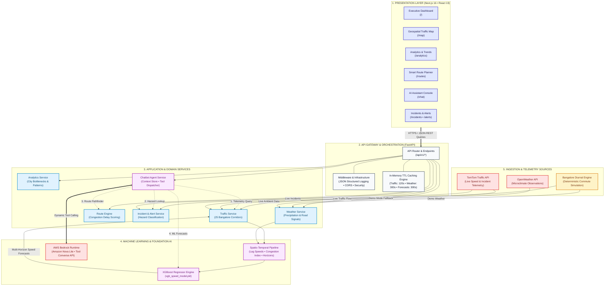
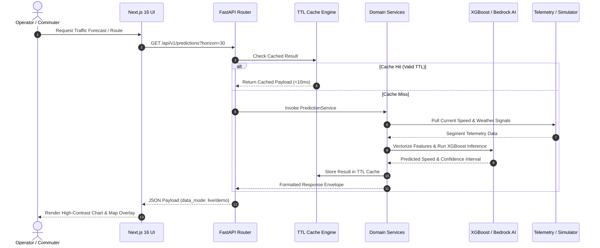

# TrafficSense.AI

<p align="center">
  
  
  
  
  
  
  
  
  
  
</p>

<p align="center">
  <strong>Intelligent Urban Mobility Monitoring, ML Speed Forecasting, and Conversational Operations Platform for Bangalore, India.</strong>
</p>

<p align="center">
  <a href="#quickstart">Quickstart</a> •
  <a href="#key-features">Features</a> •
  <a href="#architecture">Architecture</a> •
  <a href="#enterprise-saas-frontend">Frontend UI</a> •
  <a href="#ai-assistant--bedrock-integration">AI Assistant</a> •
  <a href="#ai--ml-pipeline">ML Pipeline</a> •
  <a href="#api-reference">API Reference</a> •
  <a href="#testing">Testing</a> •
  <a href="#deployment">Deployment</a>
</p>

---

## Overview

**TrafficSense.AI** is a production-grade urban traffic intelligence platform calibrated specifically for the complex arterial network of **Bangalore, India**. It combines geospatial telemetry across 25 major traffic corridors, localized weather signals, machine learning speed forecasts (XGBoost), an enterprise SaaS analytics dashboard, and a **native conversational AI assistant powered by AWS Bedrock** that autonomously interacts with backend domain services via tool calling.

Whether operating with live external telemetry (TomTom Traffic API and OpenWeather) or in zero-configuration simulated mode (`DEMO`), TrafficSense.AI provides actionable, real-time insights to traffic operators, urban planners, and commuters.

---

## Problem & Solution

### The Challenge
Bangalore consistently ranks among the most congested metropolitan areas globally. Choke points such as Central Silk Board, KR Puram, Tin Factory, Hebbal Flyover, and the Outer Ring Road tech corridor experience severe, volatile transit delays. Existing navigation systems present critical shortcomings:
1. **Fragmented Intelligence**: Congestion data, meteorological conditions, active road hazards, and routing are rarely synthesized in a unified command center.
2. **Lagging Indicators**: Conventional navigation tools report what traffic is right now—failing to offer short-horizon forecasts (15, 30, and 60 minutes ahead) necessary to evade congestion prior to trip departure.
3. **Fragile Dependencies**: Many platforms fail completely when external rate limits or API subscriptions expire, lacking graceful offline simulation fallbacks.

### The TrafficSense.AI Solution
* **Hybrid Ingestion Architecture**: Seamlessly toggles between live external APIs (TomTom and OpenWeather) and a deterministic, time-varying Bangalore diurnal simulation engine (`DEMO` mode) calibrated against authentic morning and evening rush-hour patterns.
* **XGBoost ML Forecasting**: Spatio-temporal regression models predict corridor velocity and congestion ratios up to 60 minutes into the future with horizon-aware confidence estimation.
* **Congestion-Aware Routing Engine**: Evaluates alternative corridors between prominent Bangalore hubs, scoring paths with dynamic congestion penalties.
* **Conversational Agent (AWS Bedrock)**: Employs Amazon Nova Lite with dynamic tool calling to answer complex multi-turn inquiries regarding corridor speeds, predictions, incidents, and optimal transit routes.
* **Enterprise Modern SaaS Frontend**: A redesigned, high-performance web interface built on Next.js 16 (Turbopack), React 19, Tailwind CSS, Leaflet, and Recharts with global spotlight search (`⌘K`).

---

## Key Features

* **25 Monitored Bangalore Arterial Corridors**: Real-time speeds, baseline free-flow metrics, and delays covering Outer Ring Road, Silk Board, Whitefield, Electronic City Flyover, Indiranagar 100ft Rd, MG Road, Hebbal, KR Puram, and Sarjapur Road.
* **Normalized Congestion Index**: Standardized, clamped ratio mapping corridor strain:
  $$\text{congestion\_ratio} = \text{clamp}\left(1 - \frac{v_{\text{current}}}{v_{\text{free\_flow}}},\, 0,\, 1\right)$$
  Classified into 4 semantic tiers:
  * 🟢 **Free Flow (`LOW`)**: $< 0.25$
  * 🟡 **Moderate (`MODERATE`)**: $0.25 - 0.49$
  * 🟠 **Heavy (`HIGH`)**: $0.50 - 0.74$
  * 🔴 **Severe (`SEVERE`)**: $\ge 0.75$
* **Multi-Horizon ML Forecasting**: Segment speed and congestion predictions across 15m, 30m, and 60m horizons.
* **Conversational AI Traffic Operator**: Natural-language operational assistant powered by AWS Bedrock (`amazon.nova-lite-v1:0`) with 7 backend tools and multi-turn context memory.
* **Interactive Full-Screen Map**: Leaflet.js geospatial visualizer with color-coded vector polylines, layer toggles (flow, incidents, roadwork, closures, CCTV), and instant inspection drawers.
* **Advanced Analytics Suite**: Visual breakdown of citywide congestion distributions, 24-hour speed vs. congestion dual-axis charts, bottleneck rankings, and instant CSV export.
* **Active Incident & Hazard Management**: Filterable directory of accidents, construction, and road closures with lane blockage details and clearance estimates.
* **Smart Route Comparison**: Origin-to-destination pathfinding with landmark presets, congestion avoidance toggles, and turn-by-turn navigation previews.
* **Real-Time Notification Feed**: Priority alerts for sudden congestion spikes, hazardous weather conditions, and critical traffic blockades.

---

## Architecture



### End-to-End Request & Inference Lifecycle



### Architectural Tier Breakdown

| Tier | Component | Primary Responsibility | SLA / Latency |
|---|---|---|---|
| **1. Presentation** | Next.js 16 (App Router) + React 19 + Tailwind CSS | Responsive dashboard, full-screen Leaflet traffic map, Recharts trends, route comparison, and conversational operator console (`/chat`). | Pre-rendered static shell (`< 50ms` FCP) |
| **2. Gateway** | FastAPI + Starlette + Middleware | Route dispatch, strict Pydantic v2 validation, CORS authorization, structured JSON access logging, and in-memory TTL caching. | `< 5ms` overhead |
| **3. Domain Services** | Python 3.11 Microservices | Core business logic for traffic corridor normalization, route delay penalties, incident tracking, and Bedrock tool dispatching. | `< 15ms` execution |
| **4. AI / ML** | XGBoost Regressor + AWS Bedrock | 9-feature spatio-temporal speed forecasts (15/30/60m) and multi-turn conversational AI reasoning via Amazon Nova Lite. | ML: `< 20ms` • Bedrock: `~600–1200ms` |
| **5. Ingestion** | TomTom API + OpenWeather + Diurnal Engine | Hybrid telemetry acquisition with automatic zero-credential fallback simulation calibrated for Bangalore traffic peaks. | Scheduled polling + 120s TTL |

---

## Enterprise SaaS Frontend

The user interface has been engineered following modern high-performance design specifications (clean Auralis-inspired aesthetic), optimized for desktop workstations, tablets, and field devices.

### Core Frontend Architecture
* **Framework**: Next.js 16.3.5 (App Router with Turbopack) & React 19.
* **Component Design**: Modular architecture with 16px rounded cards (`rounded-2xl`), subtle borders, soft shadows, and deep indigo brand accents (`oklch(0.38 0.16 262)` / `#2563eb`).
* **Global Command Menu (`⌘K`)**: Instant keyboard-driven spotlight search for switching between pages and zooming directly to specific Bangalore corridors.
* **Responsive Shell**: Collapsible sidebar navigation, dynamic breadcrumbs, live telemetry indicators, and system health status.

### Views & Capabilities

| Route | View | Description & Components |
|---|---|---|
| `/` | **Dashboard** | Executive operational overview: 4 KPI metric cards, interactive Leaflet mini-map, top congested corridors, 24h speed vs congestion trend chart, ML prediction cards, and localized weather advisory. |
| `/map` | **Traffic Map** | Full-screen interactive geospatial workspace: floating control bar, corridor search, congestion filter, layer toggles (flow polylines, incidents, roadwork, closures, CCTV), and road detail inspection drawer. |
| `/analytics` | **Analytics & Trends** | 5 Recharts visualizations: Congestion level distribution (donut), 24h hourly speed vs congestion dual-axis, top 5 bottleneck rankings, current vs free-flow speed delta, incident classification, and CSV export. |
| `/predictions` | **AI Forecasts** | Short-term ML forecasting: 15m, 30m, and 60m horizon tabs, corridor filters, prediction cards with speed deltas and confidence ratings, speed projection timeline, and XGBoost model architecture breakdown. |
| `/routes` | **Smart Route Planner** | Congestion-aware pathfinding: origin/destination inputs, quick-swap, Bangalore landmark presets, alternative routes comparison (fastest, balanced, distance), Leaflet route polylines, and turn-by-turn navigation preview. |
| `/incidents` | **Incident Management** | Incident response feed: summary KPI counters, severity filters (Critical, High, Medium, Low), incident type filtering, verified badges, affected lanes, estimated clearance duration, and deep links. |
| `/alerts` | **Alerts Feed** | Real-time traffic alerts: unread counter badge, severity filtering, individual mark read/unread toggles, batch "Mark All as Read", and quick navigation actions. |
| `/chat` | **AI Traffic Assistant** | Conversational operator console: suggested prompt pills, multi-turn dialogue, tool execution status badges, markdown message bubbles, and contextual action buttons ("View on Map", "Check Predictions", "Find Route"). |
| `/settings` | **Preferences & Health** | Operator profile settings, corridor notification toggles connected to `PUT /api/v1/users/preferences`, map default controls, saved locations manager, and live backend/ML health diagnostics. |

---

## AI Assistant & Bedrock Integration

The platform includes an enterprise conversational AI agent powered by **AWS Bedrock** utilizing **Amazon Nova Lite** (`amazon.nova-lite-v1:0`). Operating in an autonomous **tool-use loop**, the assistant interprets intent, calls backend domain tools, and synthesizes data-backed recommendations.

### Tool Execution Flow

```
User Query: "What is traffic like on Outer Ring Road and will it get worse in 30 minutes?"
   │
   ▼
POST /api/v1/chat ──► ChatbotService ──► Bedrock Converse API
                                            │
                              ┌─────────────┴─────────────┐
                              ▼                           ▼
                     Tool 1: get_current_traffic   Tool 2: get_traffic_prediction
                     (road: "Outer Ring Road")    (horizon: 30, road: "Outer Ring Road")
                              │                           │
                              └─────────────┬─────────────┘
                                            ▼
                           Bedrock Synthesizes Live Telemetry
                                            │
                                            ▼
            Response + UI Actions (e.g. FOCUS_MAP lat/lng) returned to Chat UI
```

### Available Domain Tools

| Tool Name | Domain Service | Description |
|---|---|---|
| `get_current_traffic` | `TrafficService` | Queries real-time velocity, congestion ratio, and delays across 25 corridors |
| `get_traffic_incidents` | `IncidentService` | Retrieves active accidents, road closures, and hazard locations with severity |
| `get_weather` | `WeatherService` | Fetches temperature, precipitation, humidity, wind, and visibility |
| `get_traffic_prediction` | `PredictionService` | Executes XGBoost inference for 15, 30, or 60-minute forecast horizons |
| `find_route` | `RouteService` | Computes congestion-penalized routes and alternatives between Bangalore landmarks |
| `get_traffic_analytics` | `AnalyticsService` | Aggregates citywide congestion averages and bottleneck rankings |
| `get_alerts` | `AlertsService` | Lists active high-priority traffic hazards and weather warnings |

### Context Memory
The `ConversationStore` maintains a sliding window of the last 20 messages per `conversation_id`, enabling multi-turn contextual reasoning (e.g., asking *"How is Silk Board?"* followed by *"What about in an hour?"* preserves corridor context).

---

## AI / ML Pipeline

### Model Architecture
The traffic prediction engine uses an **XGBoost Regressor** (`xgboost.XGBRegressor`), optimized for tabular spatio-temporal dynamics and non-linear peak-hour congestion patterns with minimal inference overhead.

### Feature Engineering (9 Features)
| Feature | Type | Description |
|---|---|---|
| `hour` | `int` (0–23) | Hour of the day in Indian Standard Time (IST) |
| `day_of_week` | `int` (0–6) | Day of week (Monday = 0, Sunday = 6) |
| `is_weekend` | `binary` (0/1) | Weekend flag |
| `segment_idx` | `int` (0–24) | Monitored corridor index |
| `free_flow_speed` | `float` (km/h) | Baseline free-flow design speed |
| `lag_speed_1h` | `float` (km/h) | Observed speed from the preceding hour |
| `lag_congestion_1h` | `float` (0–1) | Congestion ratio from the preceding hour |
| `temperature` | `float` (°C) | Current ambient temperature |
| `is_rainy` | `binary` (0/1) | Precipitation indicator |

**Target Variable**: `current_speed` (km/h, clamped between 2 km/h and design free-flow speed).

### Evaluation & Test Metrics
Trained and evaluated on a **time-aware chronological split** over 90 days of synthetic Bangalore traffic data (54,000 records) to eliminate data leakage:
* **Train Set**: Days 0–62 (37,800 samples)
* **Validation Set**: Days 63–76 (8,400 samples)
* **Test Set**: Days 77–89 (7,800 samples)

| Metric | Result | Operational Meaning |
|---|---|---|
| **$R^2$ Score** | **0.8911** | ~89.1% of speed variance explained by the model |
| **MAE** | **4.578 km/h** | Mean absolute error between predicted and actual speed |
| **RMSE** | **5.986 km/h** | Root mean square error with controlled outlier variance |

### Feature Importance Weights
```
lag_speed_1h       0.6154  ██████████████████████████████
free_flow_speed    0.0977  █████
lag_congestion_1h  0.0920  ████
is_weekend         0.0728  ███
hour               0.0579  ██
day_of_week        0.0242  █
is_rainy           0.0169  █
segment_idx        0.0166  █
temperature        0.0065  ▏
```

---

## Tech Stack

```
Frontend:
├── Framework: Next.js 16.3.5 (App Router, Turbopack)
├── UI Core: React 19.0.0 & Tailwind CSS
├── Mapping: Leaflet.js & React-Leaflet
├── Visualizations: Recharts
├── State & Cache: TanStack React Query 5
└── Icons: Lucide React

Backend:
├── Framework: FastAPI & Starlette
├── Server: Uvicorn (ASGI)
├── Validation: Pydantic v2
├── ML Engine: XGBoost, Scikit-learn, Joblib
├── LLM Integration: AWS Bedrock Runtime (Boto3)
└── Caching: Cachetools (In-memory TTL)

Infrastructure:
├── Containers: Docker & Docker Compose (Multi-stage)
└── Testing: Pytest (22 API/Integration tests), ESLint
```

---

## Quickstart

### 1. Clone the Repository
```bash
git clone https://github.com/Shashwat-19/TrafficSense-AI.git
cd TrafficSense-AI
```

### 2. Run with Docker Compose (Recommended)
```bash
# Copy backend environment configuration
cp backend/.env.example backend/.env

# Build and start services
docker-compose up --build
```
* **Web Application**: [http://localhost:3000](http://localhost:3000)
* **Interactive AI Assistant**: [http://localhost:3000/chat](http://localhost:3000/chat)
* **FastAPI Swagger Docs**: [http://localhost:8000/docs](http://localhost:8000/docs)

---

### 3. Manual Local Development

#### Backend Setup
```bash
cd backend
python3 -m venv venv
source venv/bin/activate          # On Windows: .\venv\Scripts\activate
pip install -r requirements.txt

cp .env.example .env              # Configure AWS credentials if using Bedrock
uvicorn app.main:app --host 0.0.0.0 --port 8000 --reload
```

Verify backend health:
```bash
curl http://localhost:8000/api/v1/health
```

#### Frontend Setup
In a new terminal window:
```bash
cd frontend
npm install
cp .env.local.example .env.local
npm run dev
```
Access the application at [http://localhost:3000](http://localhost:3000).

---

## Project Structure

```
.
├── backend/
│   ├── app/
│   │   ├── api/v1/endpoints.py          # REST route declarations (/traffic, /chat, /routes, etc.)
│   │   ├── core/
│   │   │   ├── config.py                # Pydantic BaseSettings & AWS Bedrock configuration
│   │   │   └── middleware.py            # Structured JSON latency & access logging
│   │   ├── models/
│   │   │   ├── artifacts/xgb_speed_model.pkl
│   │   │   └── schemas.py               # Pydantic schemas (Traffic, Route, Chat, etc.)
│   │   ├── services/
│   │   │   ├── alerts.py                # Real-time traffic and hazard alerts
│   │   │   ├── analytics.py             # Citywide traffic aggregations and trends
│   │   │   ├── chatbot.py               # AWS Bedrock Converse API service & memory
│   │   │   ├── chatbot_tools.py         # 7 domain tool specifications & execution handlers
│   │   │   ├── incident.py              # Active road hazards, accidents, and closures
│   │   │   ├── prediction.py            # XGBoost speed forecasting engine
│   │   │   ├── route.py                 # Multi-alternative route evaluator
│   │   │   ├── traffic.py               # 25 Bangalore corridors & diurnal simulation
│   │   │   ├── user.py                  # User preferences & saved locations
│   │   │   └── weather.py               # Weather patterns & OpenWeather client
│   │   └── main.py                      # FastAPI application entry point & CORS
│   ├── tests/
│   │   └── test_api.py                  # Pytest test suite (22 passing tests)
│   ├── Dockerfile
│   ├── requirements.txt
│   └── train_model.py                   # Model training script
├── frontend/
│   ├── src/
│   │   ├── app/
│   │   │   ├── alerts/page.tsx          # Real-time alerts notification feed
│   │   │   ├── analytics/page.tsx       # Traffic analytics & Recharts visualizations
│   │   │   ├── chat/page.tsx            # AI Traffic Assistant chat console
│   │   │   ├── incidents/page.tsx       # Incident directory & severity filters
│   │   │   ├── map/page.tsx             # Interactive Leaflet traffic map workspace
│   │   │   ├── predictions/page.tsx     # ML forecast horizons (15/30/60m)
│   │   │   ├── routes/page.tsx          # Congestion-aware route planner
│   │   │   ├── settings/page.tsx        # System health & user preferences
│   │   │   ├── layout.tsx               # Root layout shell
│   │   │   ├── page.tsx                 # Primary executive dashboard
│   │   │   └── providers.tsx            # TanStack Query & theme providers
│   │   ├── components/
│   │   │   ├── alerts/                  # Alert cards and feed components
│   │   │   ├── analytics/               # Distribution, trend, and bottleneck charts
│   │   │   ├── chatbot/                 # Message bubbles, tool results, conversation list
│   │   │   ├── dashboard/               # Metric cards, previews, and weather widgets
│   │   │   ├── incidents/               # Incident cards and classification filters
│   │   │   ├── layout/                  # Collapsible sidebar, header, command menu (⌘K)
│   │   │   ├── predictions/             # Forecast cards and projection timeline
│   │   │   ├── routes/                  # Route cards and preview map
│   │   │   ├── traffic/                 # Road details drawer, traffic map, legend
│   │   │   └── ui/                      # Base UI design system components
│   │   ├── lib/
│   │   │   ├── api/client.ts            # Typed HTTP & chat API client
│   │   │   ├── congestion.ts            # Semantic traffic status tokens & helpers
│   │   │   └── utils.ts                 # ClassName merger
│   │   └── types/index.ts               # TypeScript data definitions
│   ├── Dockerfile
│   ├── package.json
│   └── next.config.ts
├── Dockerfile                           # Production multi-stage unified container
├── docker-compose.yml                   # Multi-service composition
├── docker-entrypoint.sh                 # Container process supervisor
├── LICENSE
├── README.md
└── run.md                               # Comprehensive operational runbook
```

---

## API Reference

All responses conform to a unified standard envelope:
```json
{
  "data": { ... },
  "data_mode": "demo",
  "last_updated": "2026-09-25T10:00:00Z",
  "source": "traffic"
}
```

### Endpoints Catalog

| Method | Endpoint | Description | Parameters / Payload |
|---|---|---|---|
| `GET` | `/api/v1/health` | System health check and status | None |
| `GET` | `/api/v1/traffic/current` | Telemetry for all 25 Bangalore corridors | None |
| `GET` | `/api/v1/traffic/incidents` | Active traffic incidents & hazards | Query: `severity`, `incident_type` |
| `GET` | `/api/v1/weather` | Current Bangalore weather metrics | None |
| `GET` | `/api/v1/predictions` | Multi-horizon ML speed forecasts | Query: `horizon` (15/30/60), `segment_id` |
| `POST` | `/api/v1/routes` | Alternative route recommendations | Body: `RouteRequest` (origin, destination, avoid_congestion) |
| `GET` | `/api/v1/analytics` | Aggregated citywide statistics | None |
| `GET` | `/api/v1/alerts` | Urgent alerts & notifications | Query: `alert_type`, `severity` |
| `GET` | `/api/v1/users/preferences` | Retrieve user preferences & saved hubs | None |
| `PUT` | `/api/v1/users/preferences` | Update notifications & unit preferences | Body: `UserPreferences` |
| `POST` | `/api/v1/chat` | Send query to Bedrock AI Assistant | Body: `ChatRequest` (`message`, `conversation_id`) |
| `DELETE` | `/api/v1/chat/{conversation_id}` | Reset context memory for a session | Path: `conversation_id` |

* **Interactive Swagger UI**: [http://localhost:8000/docs](http://localhost:8000/docs)
* **ReDoc Specification**: [http://localhost:8000/redoc](http://localhost:8000/redoc)

---

## Testing & Quality Assurance

### Backend Test Suite (Pytest)
The test suite consists of **22 automated unit and integration tests** verifying endpoints, models, routing logic, conversation memory, and tool execution:

```bash
cd backend
source venv/bin/activate
pytest tests/ -v
```

```
======================== 22 passed, 2 warnings in 3.64s ========================
tests/test_api.py::test_health_check PASSED
tests/test_api.py::test_root PASSED
tests/test_api.py::test_get_current_traffic PASSED
tests/test_api.py::test_get_incidents PASSED
tests/test_api.py::test_get_incidents_with_filter PASSED
tests/test_api.py::test_get_weather PASSED
tests/test_api.py::test_get_predictions PASSED
tests/test_api.py::test_get_predictions_invalid_horizon PASSED
tests/test_api.py::test_get_predictions_30min PASSED
tests/test_api.py::test_get_predictions_60min PASSED
tests/test_api.py::test_post_routes PASSED
tests/test_api.py::test_get_analytics PASSED
tests/test_api.py::test_get_alerts PASSED
tests/test_api.py::test_get_user_preferences PASSED
tests/test_api.py::test_update_user_preferences PASSED
tests/test_api.py::test_chat_endpoint_exists PASSED
tests/test_api.py::test_chat_invalid_request PASSED
tests/test_api.py::test_chat_missing_body PASSED
tests/test_api.py::test_chat_delete_conversation PASSED
tests/test_api.py::test_chatbot_tools_execute PASSED
tests/test_api.py::test_chatbot_conversation_store PASSED
tests/test_api.py::test_chat_root_endpoint_includes_chat PASSED
```

### Frontend Code Quality & Build Verification
The frontend code adheres strictly to TypeScript and ESLint standards with zero compiler warnings or errors:

```bash
cd frontend
npm run lint       # Result: 0 errors, 0 warnings
npm run build      # Result: All 12 routes static and prerendered cleanly
```

---

## Deployment

### Option 1: Multi-Container Orchestration (`docker-compose.yml`)
Deploys isolated frontend and backend containers connected via an internal Docker bridge network with health checking:
```bash
docker-compose up --build -d
```

### Option 2: Unified Production Container (`Dockerfile`)
Packages both the FastAPI backend and Next.js static output into a single lightweight production image supervised by `docker-entrypoint.sh`:
```bash
docker build -t trafficsense-ai:latest .
docker run -p 3000:3000 -p 8000:8000 --env-file backend/.env trafficsense-ai:latest
```

---

## Documentation & Operational Runbook

* **Operational Runbook**: See [run.md](./run.md) for full commands, incident handling, and environment variables.
* **Architecture Articles & Writeups**: Read the complete engineering overview on [Hashnode](https://hashnode.com/@Shashwat56).

---

## License

This project is licensed under the **MIT License** — see the [LICENSE](./LICENSE) file for details.

---

## Contact & Author

### Shashwat
**Machine Learning Engineer \| Scalable AI Systems**

* 🔹 **ML Systems**: Computer Vision, NLP, Spatio-Temporal Forecasting, Data Pipelines
* 🔹 **Full Lifecycle**: Model Training $\rightarrow$ Production Serving $\rightarrow$ Enterprise UI
* 🔹 **Backend & Cloud**: Python, FastAPI, Node.js, Docker, AWS Bedrock

<p>
  <a href="https://github.com/Shashwat-19"></a>
  <a href="https://www.linkedin.com/in/shashwatk1956/"></a>
  <a href="mailto:shashwat1956@gmail.com"></a>
  <a href="https://hashnode.com/@Shashwat56"></a>
  <a href="https://www.hackerrank.com/profile/shashwat1956"></a>
</p>
